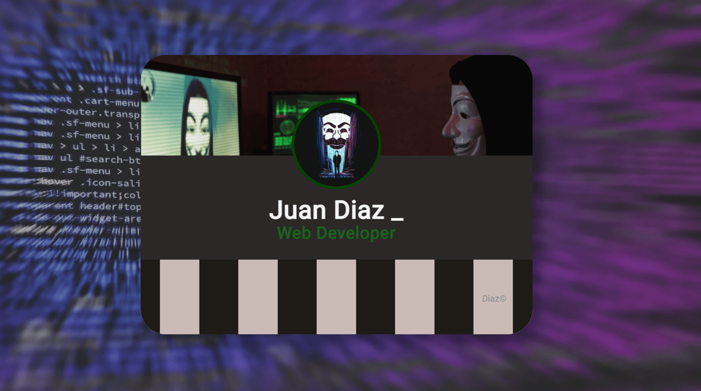

<!-- PROJECT LOGO -->
 

  <h1>Mr. Robot</h1>
    

<!-- TABLE OF CONTENTS -->

  
Table of Contents

  <ol>
    <li>
      <a href="#about-the-project">About The Project</a>
      <ul>
        <li><a href="#built-with">Built With</a></li>
      </ul>
    </li>
    <li><a href="#content">Content</a></li>
    <li><a href="#contact">Contact</a></li>
    <li><a href="#acknowledgments">Acknowledgments</a></li>
  </ol>

<!-- ABOUT THE PROJECT -->

## About The Project 💡

I did not have a web dev internshipe while taking classes at CPCC, my internship was as a Service Desk Analyst at CPCC.

However, his readme file includes a little project that I developed on my spare time on 2019.

<!-- BUILD WITH -->

### Built With 🔑

This project has been developed utilizing the Hyper Text Markup Language (HTML) and Cascading Style Sheets (CSS), supplemented with Javascript (JS) functionality.

<!-- CONTENT -->

## Content 🚦

⭐
    <a href="https://juanpablodiaz.github.io/2021/mrRobot/">Project</a>
    ⭐
  

  

    

Class folder Link: [https://github.com/JuanPabloDiaz/JuanPabloDiaz.github.io/tree/master/2021/mrRobot](https://github.com/JuanPabloDiaz/JuanPabloDiaz.github.io/tree/master/2021/mrRobot)

<!-- CONTACT -->

## Contact 📞

<!-- ACKNOWLEDGMENTS -->

## Acknowledgments 📚

Resources list that I find helpful and would like to give credit to.

- [Central Piedmont Community College](https://www.cpcc.edu/)
- [w3schools](https://www.w3schools.com/)

(<a href="#top">👆 Top 👆</a>)

<!-- MARKDOWN LINKS & IMAGES -->
<!-- https://www.markdownguide.org/basic-syntax/#reference-style-links -->
